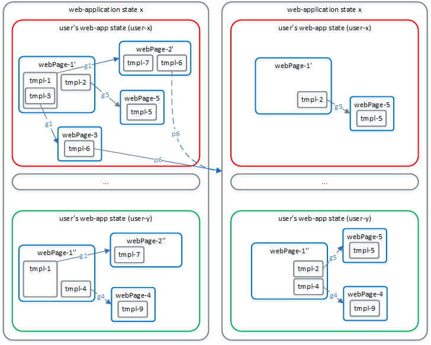

# jaxsnoop

An AJAX web-crawler based on NodeJS and selenium-webdriver, constructed for creation of web-application model, usable for future vulnerabilities search.

*This project is not "ready-to-use framework". There is a lot of improvements to be done.*


# Table of Contents

1. [Ideology](#ideology)
1. [web-crawling process](#web-crawling-process)
    1. [web-app model](#web-app-model)
    1. [web-app model construction](#web-app-model-construction)
1. [JaxSnoop structure and data structure](#jaxsnoop-structure-and-data-structure)
1. [Future work](#future-work)
    1. [impovements](#improvements)
    1. [detecting vulnerabilities](#detecting-vulnerabilities)
1. [Technologies reasoning](#technologies-reasoning)
1. [Tests](#tests)
1. [dummy](#dummy)


# Ideology

Modern web-crawlers for creating site-models (such as crawljax, htcap, ReRIA(CReRIA, CrawRIA), WebMate, ...) has two drawbacks:
1. They expect web-app ***has no state*** on server-side or it can be dropped to inital state at any moment (e.g. LXC, virtual machines, ...)
1. They do not think about crawling web-application for ***several users***.

JaxSnoop project is a web-crawler for creating web-site model overcoming those drawbacks.
<br>Created model must be usefull for future web-app testing and vulnerabilities automatic search.

JaxSnoop based on next concepts:

1. Divide all user's clickables into two categories:
    * clickables ***changing*** web-app state (`p-clk` or `p-clickables`)
    * clickables ***not chaning*** web-app state (`g-clk` or `g-clickables`)

    *In this project clickables leading to 'POST' HTTP method are expected to change web-app state, other clickables are expected not to change web-app state (though they certainly can change web-page state).*

1. ***Template extraction*** from various web-pages. Two DOM-subtrees appear to be representation of one template, if:
    * subtrees are isomorphous
        * nodes are *equal* termwise
        * structures of ordered trees are fully equal
    * some predicate must analyse subtrees and confirm their equality

1. **Fixed** clickable for **fixed** user for **fixed** template always leads to ***the same*** web-app functionality, regardless of web-page containing template and web-app state containing opened web-page.
    <br>This condition allows to steadily bind web-app functionality with web-app view.

1. Web application does not change its state randomly. Only after user's clicks.


# web-crawling process

## web-app model

* web-app model - state and transition graph
    * web-app state
        * web-app users state - oriented rooted tree
            * web-page state
                * web-page templates - contains clickables

Illustration of two states in web-app model:


## web-app model construction

1. Construction of web-app model: Crawl web-application by creating model for each web-application state and performing unique (according to template extraction) *p-clickable* actions to move from one web-app state to another.

1. Construction of web-app state: Construct current *user's web-app state* by crawling web-application in the name of each user separately and performing only unique (according to template extraction) *g-clickable* actions. All web-pages must be fixed.

1. From each fixed web-page must be extracted its templates.


# JaxSnoop structure and data-structure

Here I will explain the core specifics of programmed in JaxSnoop model and crawling process.

Web-page model are copyed DOM-tree. Each node has `type`, `parent`, `childNodes`, ..., `props`, `clickables`, ...
* if `type` === `undefined` => this node is snapshot of DOM-node
    <br>`childNodes` are array of links to child-nodes
* if `type` === `'tmpl'` => this node is link to some template
    <br>`childNodes` are array of objects: {`child`: link to child-node, `tmplNode`: link to node in template from which child-subtree is fastened}
* `parent` is link to parent node, but for root-nodes of web-page (parent will point to web-page object containing various routine info) and for root-nodes of template (parent will point to template object containing various routine info)

It is important to understand, that web-page model consists of DOM-nodes and template pointer-nodes. Template's models (template-subtrees) consists **only** of DOM-nodes.
<br>If template has another template as a child in some web-page, then that web-page will has two nodes (parental and descendant) linking templates.

All clickables are examined only in context of some template. If there is web-page containing node with clickable and this node is not part of template, then it will be never analyzed. At least this node must be extracted into separate template with mark `tmpl.corrupted === true` (this mark will disable this template to participate in template extraction process and will never be compared to anything).

`node.clickables` example (`i_pstate` - global numeration of web-app states):
``` javascript
node.clickables = [{
    clk: 'onclick',
    'user_1': {
        type: 'g',
        webAppStates: [{
            i_pstate: integer,
            webPage: link_to_webPage
        }, ...]
    },
    'user_2': {
        type: 'p',
        webAppStates: [{
            i_pstate: integer,
            webAppStateSrc: link_to_webApp_State,
            webAppStateDst: link_to_webApp_State
        }, ...]
    },
    `user_3`: {
        type: 'd' /*d - deny - something got wrong with this clickable, disable it forever*/
    }
}, {}]
```


`WebAppTmplModel` class in `tmpl-model.js` contains:
* `this.templates` - array of templates objects
    <br>Each template object has pointers to the places in different webPages were it is inserted.
* `this.webAppPageList` - array of web-pages registered by WebAppTmplModel
* `this.addDomModel(domModel)` - function of registering new web-page. domModel is root-node for some DOM-tree snapshot.
    <br>template detection works in several steps:
    * using *inner* variales `addRoutine` all ***similar*** subtrees are colored in unique color.
    * after nodes of new web-page was colored, subtrees of the web-page with nodes of the same color-set will be captured and ***if their configuration is good enough (this is function similar to the function comparing similar subtrees)*** new template will be constructed.
        * if new template is part of some existed template then existed template will be divided into smaller templates. All links from web-pages to old template must be putched => there will be several nodes pointing to newly-created templates.
    * after templates were extracted, remaining subtrees of web-page that is not containing any node-pointer to template will be checked ***if their configuration is good enough***
    * cleanup of `addRoutine`, because we do not needed colors any more


`ClickSearcher` class in `click-searcher.js` is handy for iterating interested nodes with interested clickables in the context of some *user's web-app state* (fixed user, fixed web-app state) - ***depth-first***

`CrawlingCtrl.crawlCurrentWebAppState(...)` - function for crawling *user's web-app state*. It works by depth-first, but depth is increasing by iterations.
<br>The main idea of function: find any unique g-clickable for current user and do it.

`CrawlingCtrl._findNextPClickable(...)` - fuction searching for next p-clickable (from some template) enabled in current web-app state, or if all p-clickables already checked, then it will search for queue of p-clickables from current web-app state to make some new p-clickable. If there is now possible queues ended with unclicked p-clickable, then function will return `undefined` meaning that the crawling process must be ended because of dead end in web-application.

`CrawlingCtrl.startCrawling(...)` - main function which is searching for p-clickable queue using `_findNextPClickable` and for each p-clickable constructs queue of g-clickables moving browser's web-page into state fitting to make targeted p-clickable. After it user's action are actually permitted.


# Future work

## Improvements

* **similarity metrics**. It is most important to correctly discover templates on web-pages. If it is done incorrect, than there will be problems with re-clicking known clickables (*if different trees treated as one template*) and problems with complexity (computational, memory, states number) (*if equal subtrees will be not recognized as single template*).
    <br>There is two similarity metrics:
    * node similarity comparison
    * subtrees similarity comparison
    * metric for checking if some picked up subtree can be extracted as template
    <br> these metrics are and `NodeProcessing` class in `tmpl-model.js`

* **algorithms improvement**. For now 3 main JaxSnoop components work not optimal:
    * template extraction is made by linear comparison between nodes of new web-page and all registered templates and web-pages (without templates subtrees)
        <br>because of many comparisons, template extraction is the most expensive operation in JaxSnoop and ***occupy too much CPU time***
    * crawling of user's web-app state are always started from one web-page (e.g. index.html)
    * crawling of web-app global state are mady by generating sequence of interested p-clickables, but to perform them it is needed to find correct sequence of g-clickables for some user's web-app state. Now g-clickables sequence is searched depth-first, however probably it is better to make it width-first.

* **serialization**. There is no serilization or deserialization of web-app model.

* **clickables extraction**. For now I only fix clickables `input (form)` and `a#href`. This can be extended a lot.
    <br>Exists the ***problem of delegated handlers*** of user's actions, when handler sits e.g. on body-tag and process all user's action previously detecting node under which user performed action and reacting differently depending on JS code. Here the idea of *JS-instrumentation* must be concidered.

* **default page**. After every p-clickable JaxSnoop start to analyse *user's web-app state* from some web-page we can always return (e.g. `index.html`). This is not good behaviour after some clickables.

* **login/logout**. Auto-detect user's logout and login browser in turn.

* **repeated clickable**. Sometimes there is clickables that act in a different way after several user's clicks. Probably we can register several sequential user's clicks (e.g on button *next*) as a separate clickable.

* **setTimeout/setInterval** problem - we can not control these actions.

* **parallelism**. Now there is only parallelism between browser instances and jaxsnoop controller instance (that is good because of main web-crawlers limitation: speed of network communication with server). For bigger parallelism there must redesign must be done. And probably code-base replacement.

## Detecting vulnerabilities

Detecting vulnerabilities:
* web-app model enables to collect ***entry points*** into web application. Entry-points can be used for automatic fuzzing for different types of vulnerabilities.
* web-app model capture connection between user's clickables and web-application state change (appear/remove of templates)
    <br>This feature can be handy for detecting vulnerabilities such as *stored-XSS*
* web-app model can be created for two users, capturing their enabled clickables
    <br>This feature can be handy for detecting *authentication vulnerabilities* (clickables that are enabled for one user, but forbidden in web-app view for another user, must be trully forbidden for another user, even if he will craft correct http-request)


# Technologies reasoning

### Selenium

All browser tries to support remoute management (mainly for sites test purposes). Obvious leader in driving browsers are **selenium**.

Alternatives:
* slimerjs (works only with firefox and uses old javascript and slimerjs scripts greatly bounded with available libraries (this is not NodeJS)).

    After an attempt, slimerjs was rejected, too many crunches and boundaries. (e.g slimerjs stdio problem: https://github.com/laurentj/slimerjs/issues/478)

* phantomjs, casperjs
* casperjs (based on slimerjs or phantomjs). Drawback: you must fully construct suite for page processing and only after that run it.

### JavaScript (nodejs)

Selenium webdriver available for: java, python, javascript, c#, ruby, php, perl.

I prefered javascript, however other languages fits too. Probably even better, because NodeJS are single-threted by design.

### selenium-webdriver

There are several javascript webdriver implementations: [some list](https://www.slant.co/topics/2814/~node-js-selenium-webdriver-client-libraries-bindings). Obvious leaders: webdriverio and webdriverjs (selenium-webdriver):

* webdriverio - synchronous implementation of asynchronous browser commands (you may not worry about promises). Main goal: make it easier to write selenium tests.
* selenium-webdriver - official javascript selenium webdriver implementation. webdriverjs code probably less clean but has more abilities.

[Code comparison example](https://github.com/webdriverio/webdriverio/issues/138)

### proxy-server (client side)

This project demand ability to intercept and drop some requests from browser. Selenium has weak capabilities (`CaptureNetworkTraffic`), therefore I will use some proxy-server (which is needed to be online configurable).

* (BMP) Browser Mob Proxy - very discussed option in internet [BMP github](https://github.com/lightbody/browsermob-proxy) [BMP official site](http://bmp.lightbody.net/) [BMP and selenium](https://keshavtechinfo.wordpress.com/web-automation/selenium/web-page-load-testing-using-selenium-and-browsermob-proxy/) [BMP rest-api](https://github.com/lightbody/browsermob-proxy#rest-api)
* [Firebug + NetExport plugin](http://www.seleniumtests.com/2012/10/capture-network-traffic-using-webdriver.html)
* ***self-made proxy***.
<br>I created standalone project [ClientProxy](https://github.com/phonexicum/ClientProxy) (proxy-server is based on [http-proxy](https://www.npmjs.com/package/http-proxy))


# Tests

* for template-extraction functionality there is tests, which checks consistancy of all links after template-detection process
* there is no valuable tests for my crawler, however:
    * it seems (checked manually) that crawler part, which is constructing *user's web-app state* by following g-clickables works correct
    * it seems that crawler part, which constructs web-app model by following p-clickables works *stable* and without compiler-errors.

## Debug

This repository contains debugging settings for *vscode* editor.

---

# dummy

* [webdriver-rtc](https://github.com/webdriverio/webdriverrtc) - enables your client instance to grep statistical data from a running WebRTC peer connection (webdriver >= v4.0)
* [browserevent](https://github.com/webdriverio/browserevent) - experimental feature that helps you to listen on events within the browser. It is currently only supported in Chrome browser (and webdriver < v3.0 - ?)
